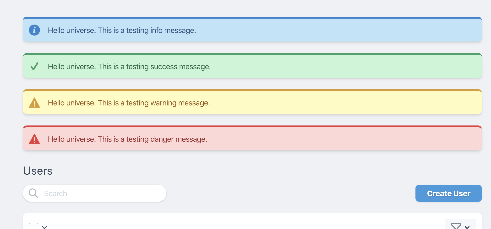
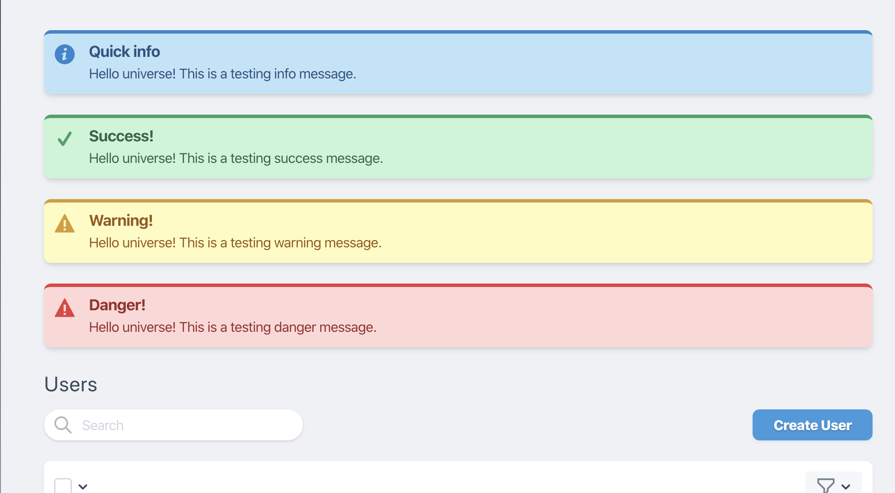

# A simple Nova info card

## Installation

```shell
composer require pdmfc/nova-info-card
```

## Usage

```php

use Pdmfc\InfoCard;

//...

public function cards()
{
    return [
        (new InfoCard())
            ->info('Some info message')
    ];
}

```

### Choosing theme

```php
->info($message)

->success($message)

->warning($message)

->danger($message)
```

```php
->message($message, $level)
// accepted values for $level => ['info', 'success' , 'warning', 'danger']
```



---

### Defining a header

```php
public function cards()
{
    return [
        (new InfoCard())
            ->info('Some info message')
            ->heading('Quick info')
    ];
}
```



---

## How to contribute

- clone the repo
- on `composer.json` of a laravel nova application add the following:

```
{
    //...

    "require" {
        "pdmfc/nova-info-card: "*"
    },

    //...
    "repositories": [
        {
            "type": "path",
            "url": "../path_to_your_package_folder"
        }
    ],
}
```

- run `composer update pdmfc/nova-info-card`

You're now ready to start contributing!
