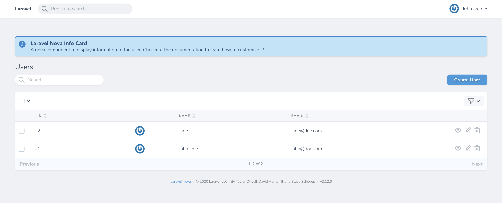
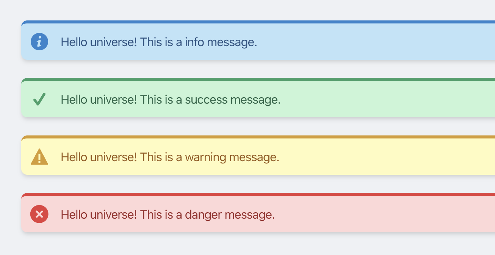
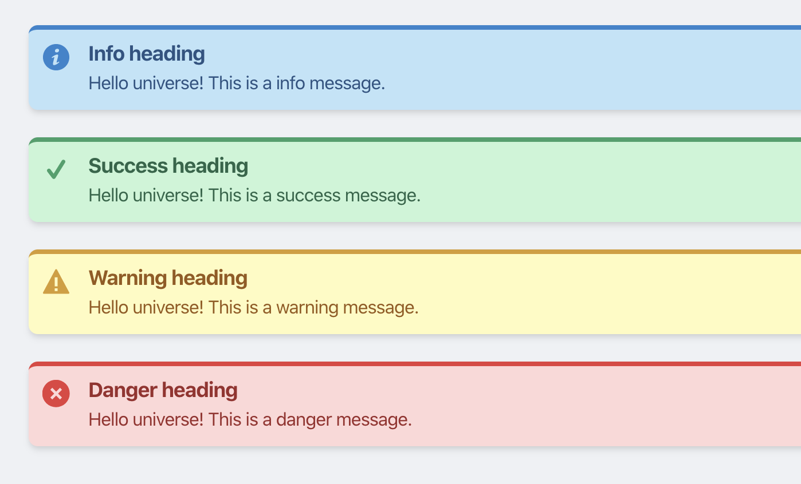

# Nova Info Card

<p align="center">
    
</p>

<p align=center>
  <a href="https://packagist.org/packages/pdmfc/nova-info-card"></a>
  <a href="https://packagist.org/packages/pdmfc/nova-info-card"></a>
  <a href="https://packagist.org/packages/pdmfc/nova-info-card"></a>
</p>

This package provides an easy-and-simple way to add notification cards to a Laravel Nova Resource.

## Installation

```shell
composer require pdmfc/nova-info-card
```

## Usage

```php
use Pdmfc\NovaCards\Info;

//...

public function cards()
{
    return [
        (new Info())
            ->info('Some info message')
    ];
}
```

### Themes

This package comes with 4 predefined styles - _info_, _success_, _warning_ and _danger_. To select a theme, just use the it as the method name.

If you need to generate a card theme dynamically, you can use the `message()` method which accepts two arguments - `$message` and `$level`.

```php
->info($message)
->success($message)
->warning($message)
->danger($message)
->message($message, $level) // accepted values for $level: 'info', 'success' , 'warning', 'danger'
```



---

### Defining a header

You can also define a heading for the message using the `heading()` method:

```php
(new Info())
    ->heading('Info heading')
    ->info('Some info message')
```



---

### Render Html

If you want to render your message as raw html the same way that Nova lets you in resource fields, just chain the `asHtml()` method:

```php
(new Info())
    ->info('Be sure to like this package and give us your feedback in
    <a href="https://github.com/pdmfc/nova-info-card/" class="underline font-bold text-blue-800">our repository</a>!')
    ->asHtml(),
```


---

## How to contribute

- clone the repo
- on `composer.json` of a laravel nova application add the following:

```
{
    //...

    "require" {
        "pdmfc/nova-info-card: "*"
    },

    //...
    "repositories": [
        {
            "type": "path",
            "url": "../path_to_your_package_folder"
        }
    ],
}
```

- run `composer update pdmfc/nova-info-card`

You're now ready to start contributing!
